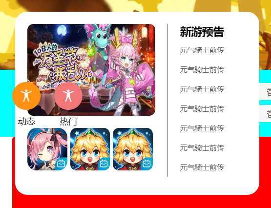

# learngit 
#### 个人主页
#### 说明
index.html为首页

main.html相关链接只制作了photowall 和article部分
#### 学习
1.精灵图的响应式制作，使用rem 和flexibel 

2.js jq 的使用
### B站
#### 说明
swiper插件制作轮播图

导航栏游戏可下拉
#### 学习
1.去除输入框和按钮的空隙
去掉标签之间的空格

2.flex实现文字上下布局
    display: flex;
    flex-direction: column;  /* 把主轴设置成y轴 */
    align-items: center;  /* 侧轴上的元素居中对齐(注意只有一个元素) */
    justify-content: center; /* 主轴上的元素居中对齐 (调整位置) */
    
3.定位元素无法覆盖下方元素

检查下方元素的position：absolute relative 会影响改变布局方式

4.js代码无法运行，要确保元素全部加载完成
    document.addEventListener('DOMContentLoaded', function () {
    });
